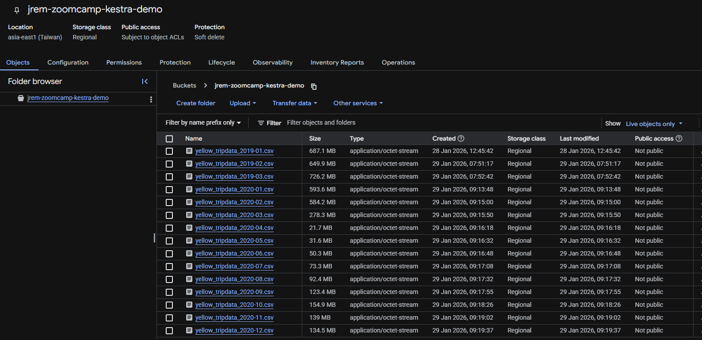
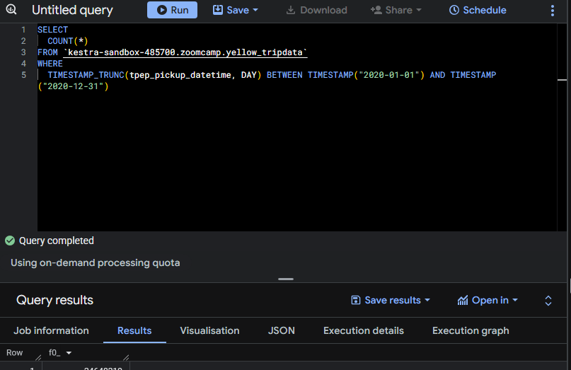
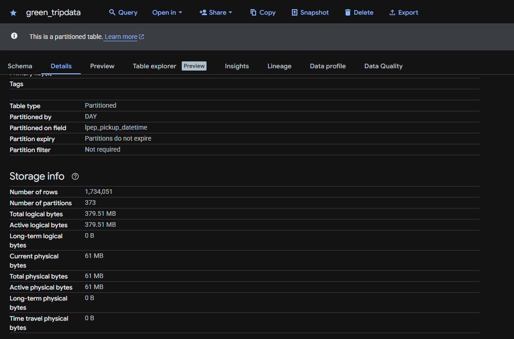
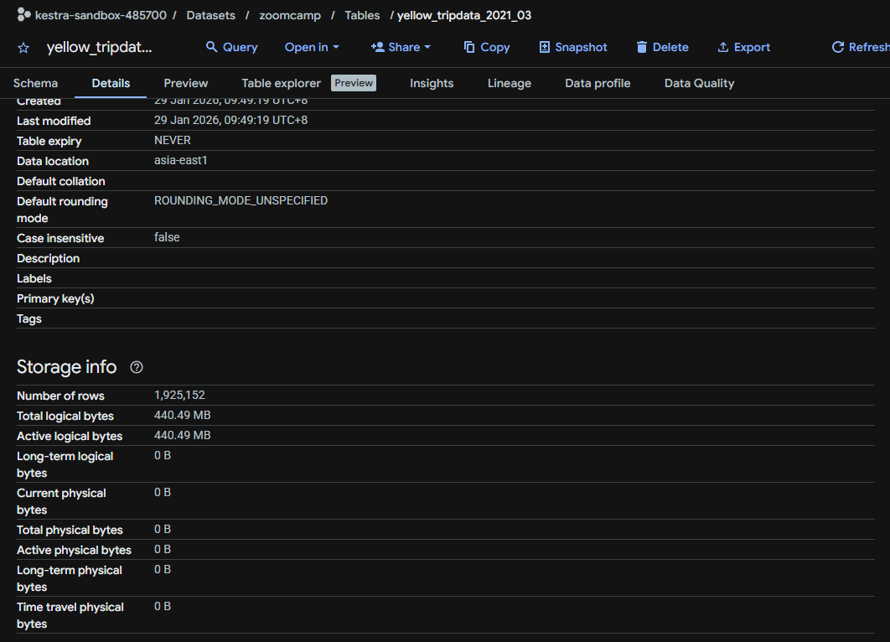

### Question 1. Within the execution for Yellow Taxi data for the year 2020 and month 12: what is the uncompressed file size (i.e. the output file yellow_tripdata_2020-12.csv of the extract task)?

The uncompressed CSV files can be found in the GCS bucket. For the file in question, the size is 134.5 MB



### Question 2. What is the rendered value of the variable file when the inputs taxi is set to green, year is set to 2020, and month is set to 04 during execution? (1 point)

In the flow code, the variable file is defined as `file: "{{inputs.taxi}}_tripdata_{{trigger.date | date('yyyy-MM')}}.csv"`. So for 2020-04 green, the rendered value is **green_tripdata_2020-04.csv**

### Question 3. How many rows are there for the Yellow Taxi data for all CSV files in the year 2020?

My `yellow_tripdata` table already contains 2019 data because of the demos so I had to filter for the year 2020. The result is **24648219**.



### Question 4. How many rows are there for the Green Taxi data for all CSV files in the year 2020?

For the `green_tripdata`, I only have 2020 data so I can just go to **Storage info** to see the number of rows which is **1,734,051**.



### Question 5. How many rows are there for the Yellow Taxi data for the March 2021 CSV file?



### Question 6. How would you configure the timezone to New York in a Schedule trigger?

According to [Kestra Docs](https://kestra.io/docs/workflow-components/triggers/schedule-trigger), a schedule that runs daily at midnight US Eastern time:

```
triggers:
  - id: daily
    type: io.kestra.plugin.core.trigger.Schedule
    cron: "@daily"
    timezone: America/New_York
```